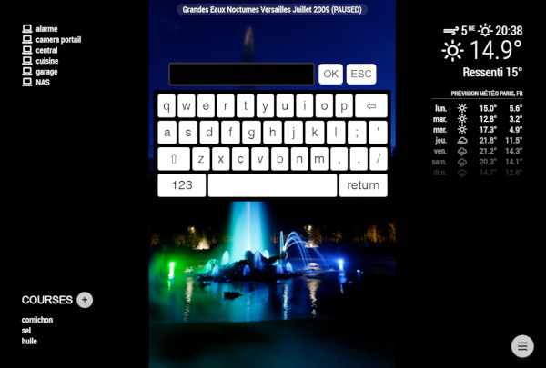

# MMM-Keyboard

Fork from the original excellent [MMM-Keyboard](https://github.com/lavolp3/MMM-Keyboard) module for the [MagicMirror²](https://github.com/MichMich/MagicMirror/) that creates a virtual keyboard to be used to send commands or text to other modules



## Installing

### Step 1 - Install the module
```javascript
cd ~/MagicMirror/modules
git clone https://github.com/jheyman/MMM-Keyboard.git
cd MMM-Keyboard
npm install
```

### Step 2 - Add module to `config.js`
Add this configuration into your `config.js` file
```javascript
{
    module: "MMM-Keyboard",
    position: "fullscreen_above",
    config: {
        style: "default",
    }
}
```

## Dependencies

* [simple-keyboard](https://www.npmjs.com/package/simple-keyboard)


# Working with the Keyboard

## Opening the keyboard

The keyboard works with MagicMirror's notification system. You can broadcast notifications from another module using the following parameters
```
this.sendNotification("KEYBOARD", {
    key: "uniqueKey",
    style: "default"
});
```

The payload of the notification must be an object containing two parameters:
`key`: You can use any unique key, it is advised to use the module name. MMM-Keyboard will take the key and send it back for the module to understand it.
`style`: Use "default" or "numbers" here,

## Receiving data

As soon as you hit the "SEND!"-Button the keyboard sends back the written content using the format

```
this.sendNotification("KEYBOARD_INPUT", {
    key: "uniqueKey",
    message: "test"
});
```

You can fetch this message by checking for the `key` component. Here an example:

```
notificationReceived : function (notification, payload) {
    if (notification == "KEYBOARD_INPUT" && payload.key === "uniqueKey") {
        console.log(payload.message);
    }
},
```